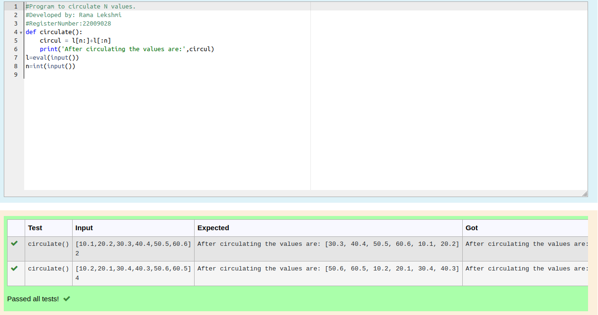

# Circulate-the-values-of-N-variables
## Aim:
To write a python program to circulate the n variables using function concept
## Equipment’s required:
PC
Anaconda - Python 3.7
## Algorithm: 
### Step 1: 
define the function
### Step 2: 
do appropriate steps
### Step 3: 
Get the value from the user for the number of rotation
### Step 4: 
Using the slicing concept rotate the list
### Step 5: 
circulating values is done
### Step 6: 
end the program
## Program:
```python
#Program to circulate N values.
#Developed by: Rama Lekshmi
#RegisterNumber:22009028
def circulate():
    circul = l[n:]+l[:n]
    print('After circulating the values are:',circul)
l=eval(input())
n=int(input())
```
## Output:

## Result:
Thus circulation of N values is done
